Define your rule and take control of your content with WordPress and Gutenberg Editor.

[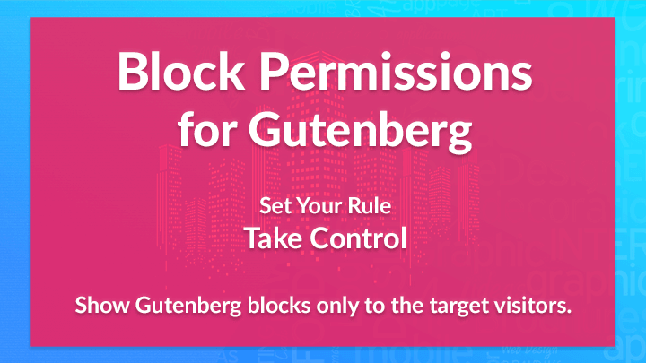](https://wordpress.org/plugins/block-permissions/)

<a class="button" target="_blank" href="https://github.com/meceware/block-permissions">SOURCE</a><a class="button" target="_blank" href="https://wordpress.org/plugins/block-permissions/">DONWLOAD</a>

Show Gutenberg editor blocks only to the target visitors or members you want with **Block Permissions**.

## Top Features

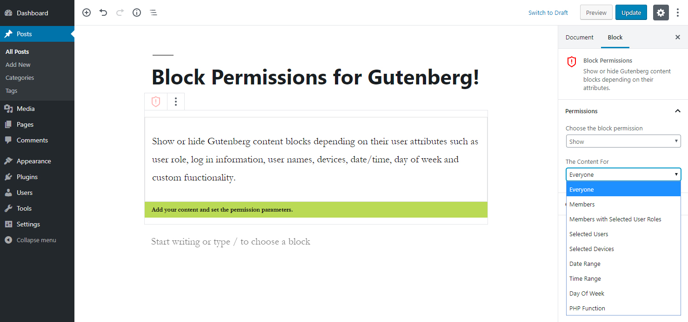

* The content will be removed from HTML output if the rule applies.
* Add multiple blocks inside Block Permissions.
* No JavaScript, no CSS at the output.

* **Members**

  Show or hide your content for members.

* **User Roles**

  Show or hide your content for members with user roles.

## Requirements

* WordPress version should be at least 5.0.
* Gutenberg should be active on the WordPress site.

## How To Install

* Login to your WordPress Dashboard.
* In your WordPress Admin Menu, go to **Plugins > Add New**.
* Click on **Upload Plugin** button found on top left corner of page.
* Click on **Browse** button. Select the `.zip` file of your plugin in your computer, and click **Install Now** button.
* Active the plugin by clicking on **Activate Plugin** link to work with the plugin.

## Add The Block With Gutenberg

* Create a new post/page or go to the post/page you would like to add the block.
* Find **Block Permissions** block on the Gutenberg blocks and add it to the page.

## How To Use

* Add your content/blocks inside the **Block Permissions** block.
* Click on the green bar at the bottom of **Block Permissions** block.
* Select the permission.
  * If the block will be shown at the frontend for the specified rule, select *Show* at the **Choose the block permission** option.
  * If the block will be hidden at the frontend for the specified rule, select *Hide* at the **Choose the block permission** option.

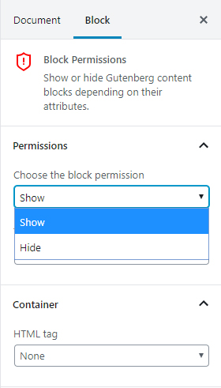

* Define your rule with the settings at **The Content For** option.

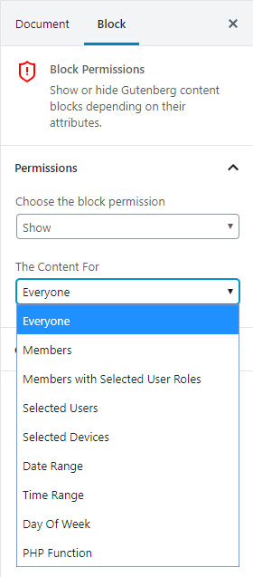

## Permission Rules

The permission rules are as following:

* [Everyone](#everyone)
* [Members](#members)
* [Members with Selected User Roles](#members-with-selected-user-roles)
* [Selected Users](#selected-users)
* [Selected Devices](#selected-devices)
* [Date Range](#date-range)
* [Time Range](#time-range)
* [Day Of Week](#day-of-week)
* [PHP Function](#php-function)

### Everyone

The block will be shown at the frontend for everyone, if *Show* at the **Choose the block permission** option is selected.

The block will be hidden at the frontend for everyone, if *Hide* at the **Choose the block permission** option is selected.

### Members

Members are defined as the users logged in to the web site.

The block will be shown at the frontend for members (if the user is logged in), if *Show* at the **Choose the block permission** option is selected.

The block will be hidden at the frontend for members (if the user is logged in), if *Hide* at the **Choose the block permission** option is selected.

### Members with Selected User Roles

Members are defined as the users logged in to the web site. Each member has joined one or more user roles defined in WordPress.

When **Members with Selected User Roles** option is selected as a rule, the user role select box will appear. You can select the necessary user roles using this select box. You can select multiple user roles.

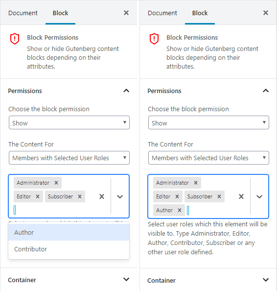

The block will be shown at the frontend for members with specified user roles, if *Show* at the **Choose the block permission** option is selected.

The block will be hidden at the frontend for members with specified user roles, if *Hide* at the **Choose the block permission** option is selected.

### Selected Users

When **Selected Users** option is selected as a rule, the user select box will appear. You can select multiple users using the select box.

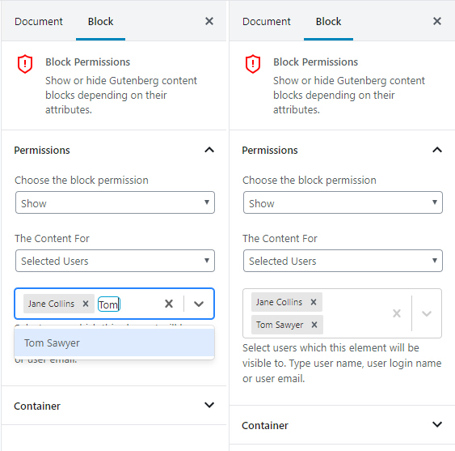

The block will be shown at the frontend for the specified users, if *Show* at the **Choose the block permission** option is selected.

The block will be hidden at the frontend for the specified users, if *Hide* at the **Choose the block permission** option is selected.

### Selected Devices

Devices are defined as *Desktops*, *Tablets* and *Phones*. When **Selected Devices** option is selected as a rule, the devices toggles will appear. You can enable/disable each device using the toggle boxes.

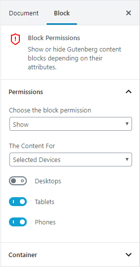

The block will be shown at the frontend for the specified devices, if *Show* at the **Choose the block permission** option is selected.

The block will be hidden at the frontend for the specified devices, if *Hide* at the **Choose the block permission** option is selected.

### Date Range

When **Date Range** option is selected as a rule, the start and end date/time boxes will appear. The range of dates can be selected using these boxes.

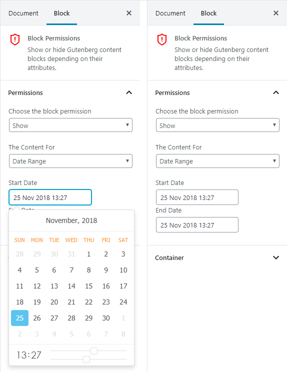

The block will be shown at the frontend for the specified date/time ranges, if *Show* at the **Choose the block permission** option is selected.

The block will be hidden at the frontend for the specified date/time ranges, if *Hide* at the **Choose the block permission** option is selected.

### Time Range

When **Time Range** option is selected as a rule, the start and end time boxes will appear. The range of times can be selected using these boxes.

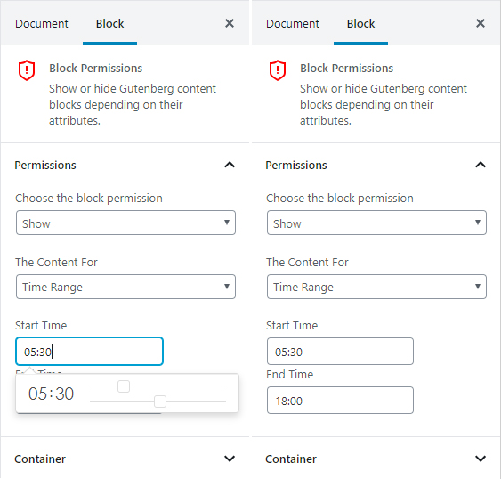

The block will be shown at the frontend for the specified time range, if *Show* at the **Choose the block permission** option is selected.

The block will be hidden at the frontend for the specified time range, if *Hide* at the **Choose the block permission** option is selected.

### Day Of Week

When **Day Of Week** option is selected as a rule, a select box with selectable days will appear. The days can be selected using these select box. Multiple days can be selected.

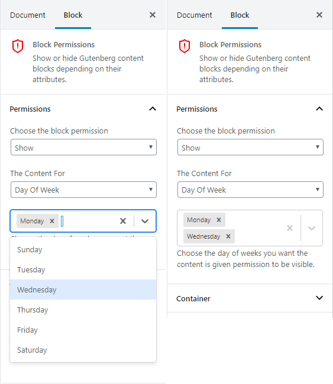

The block will be shown at the frontend on the specified days, if *Show* at the **Choose the block permission** option is selected.

The block will be hidden at the frontend on the specified days, if *Hide* at the **Choose the block permission** option is selected.

### PHP Function

When **PHP Function** is selected as a rule, a PHP function needs to be written. You can enter the PHP function name.

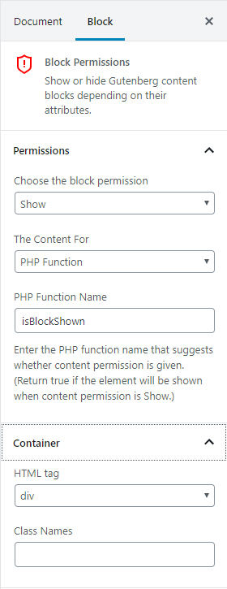

The block will be shown at the frontend if the PHP function returns true and *Show* at the **Choose the block permission** option is selected.

The block will be hidden at the frontend if the PHP function returns true and *Hide* at the **Choose the block permission** option is selected.

## Container

You can choose the container for the content inside **Block Permissions** block. Choose one of the containers available.

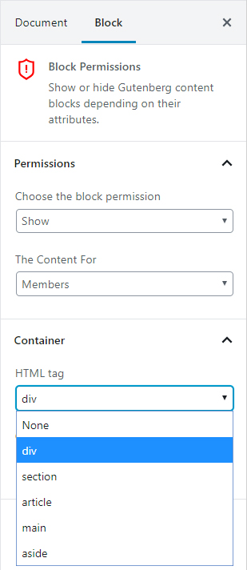
