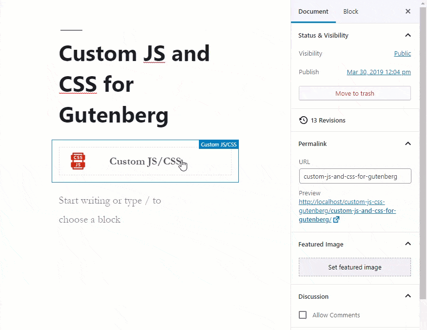

[](https://codecanyon.net/item/custom-js-and-css-for-gutenberg/23562904)

<p style="text-align:center;padding:0 20px 20px;"><a class="button" target="_blank" href="https://codecanyon.net/item/custom-js-and-css-for-gutenberg/23562904">BUY</a></p>

* Easily add your code anywhere on your WordPress page.

  * **JavaScript**
    * Between `<head>` and `</head>` tags.
    * Before closing `</body>` tag.
    * Right to the place of the block.
  * **CSS**
    * Between `<head>` and `</head>` tags.
    * Before closing `</body>` tag.
    * Right to the place of the block.
  * **Meta**
    * Between `<head>` and `</head>` tags.

* Multiple JavaScript & CSS on one page.
* No output, other than your code.
* Optimized and fast server side implementation.

## Requirements

* WordPress version should be at least 5.1.
* Gutenberg should be active on the WordPress site.

## How To Install

* Login to your WordPress Dashboard.
* In your WordPress Admin Menu, go to **Plugins > Add New**.
* Click on **Upload Plugin** button found on top left corner of page.
* Click on **Browse** button. Select the `.zip` file of your plugin in your computer, and click **Install Now** button.
* Active the plugin by clicking on **Activate Plugin** link to work with the plugin.


## Add The Block With Gutenberg

* Create a new post/page or go to the post/page you would like to add the block.
* Find **Custom JS/CSS** block on the Gutenberg blocks and add it to the page.


## JavaScript

* Easily add your custom JavaScript code to the page.
* Minify the output.
* Write in Modern JavaScript (Babel) and it will be converted to ES2015 on the fly.
* Easily add custom JavaScript files to the page, including specified dependencies.

### Inline JavaScript Code

The specified JavaScript code is placed where the block is at the output.

* Click on the block.
* Expand JavaScript panel.
* Write your code inside the **JavaScript (Inline)** text box.
* Click on Min button to minify the output.
* Select JS or Babel options.
  * When JS is selected, the script will be printed *as is*.
  * When Babel is selected, the script will be converted to ES2015.

#### Example (JS)


When JS is selected, the following code
```
function welcome( name ) {
  return 'Welcome ' + name;
}

var str = welcome( 'meceware' );
console.log( str );
```

will be

```
<script type="text/JavaScript">function welcome( name ) {
  return 'Welcome ' + name;
}

var str = welcome( 'meceware' );
console.log( str );</script>
```

and minified as

```
<script type="text/JavaScript">function welcome(e){return"Welcome "+e}var str=welcome("meceware");console.log(str);</script>
```

#### Example (Babel)

 with Custom JS & CSS")

When Babel is selected, the following code
```
const welcome = ( name ) => 'Welcome ' + name;

const str = welcome( 'meceware' );

console.log( str );
```

will be

```
<script type="text/JavaScript">var welcome = function welcome(name) {
  return 'Welcome ' + name;
};

var str = welcome('meceware');

console.log(str);</script>
```

and minified as

```
<script type="text/JavaScript">var welcome=function(e){return"Welcome "+e},str=welcome("meceware");console.log(str);</script>
```

### Head JavaScript

The specified JavaScript code is placed between `<head>` and `</head>` tags.

* Click on the block.
* Expand JavaScript panel.
* Enable **Enable Head JavaScript** option.
* Click on **JavaScript Options (Head)** button to see the options. There will be a modal window.
* Enter your JavaScript code if you. The specified JavaScript code will be placed between `<head>` and `</head>` tags. Leave empty if no code is required.
  * When JS is selected, the script will be printed *as is*.
  * When Babel is selected, the script will be converted to ES2015.
* Enter your JavaScript file URL. The specified URL will be placed between `<head>` and `</head>` tags. Leave empty if no file is required.
* Enter your JavaScript file dependencies (comma seperated). The JavaScript file URL will be enqueued according to the specified dependencies. Leave empty if no dependency is required.



### Footer JavaScript

The specified JavaScript code is placed right before closing `</body>` tag.

* Click on the block.
* Expand JavaScript panel.
* Enable **Enable Footer JavaScript** option.
* Click on **JavaScript Options (Footer)** button to see the options. There will be a modal window.
* Enter your JavaScript code if you. The specified JavaScript code will be placed before closing `</body>` tag. Leave empty if no code is required.
  * When JS is selected, the script will be printed *as is*.
  * When Babel is selected, the script will be converted to ES2015.
* Enter your JavaScript file URL. The specified URL will be placed before closing `</body>` tag. Leave empty if no file is required.
* Enter your JavaScript file dependencies (comma seperated). The JavaScript file URL will be enqueued according to the specified dependencies. Leave empty if no dependency is required.


## CSS

* Easily add your custom CSS code to the page.
* Minify the output.
* Write in SASS or LESS and it will be converted to CSS on the fly.
* Easily add custom CSS files to the page, including specified dependencies.

### Inline CSS Code

The specified CSS code is placed where the block is at the output.

* Click on the block.
* Expand CSS panel.
* Write your code inside the **CSS (Inline)** text box.
* Click on Min button to minify the output.
* Select CSS / SASS / LESS  options.
  * When CSS is selected, the code will be printed *as is*.
  * When SASS is selected, the SASS code will be converted to CSS.
  * When LESS is selected, the LESS code will be converted to CSS.

#### Example (CSS)


When CSS is selected, the following code
```
.content-area {
  position: relative;
  display: block;
  background: #f00;
}
```

will be

```
<style type="text/css">.content-area {
  position: relative;
  display: block;
  background: #f00;
}</style>
```

and minified as

```
<style type="text/css">.content-area{position:relative;display:block;background:red}</style>
```

#### Example (SASS)


When CSS is selected, the following code
```
$background: #f00;

.content-area {
  position: relative;
  display: block;
  background: $background;
}
```

will be

```
<style type="text/css">.content-area {
  position: relative;
  display: block;
  background: #f00; }
</style>
```

and minified as

```
<style type="text/css">.content-area{position:relative;display:block;background:red}</style>
```

#### Example (LESS)


When CSS is selected, the following code
```
@background: #f00;

.content-area {
  position: relative;
  display: block;
  background: @background;
}
```

will be

```
<style type="text/css">.content-area {
  position: relative;
  display: block;
  background: #f00;
}
</style>
```

and minified as

```
<style type="text/css">.content-area{position:relative;display:block;background:red}</style>
```

### Head CSS

The specified CSS code is placed between `<head>` and `</head>` tags.

* Click on the block.
* Expand CSS panel.
* Enable **Enable Head CSS** option.
* Click on **CSS Options (Head)** button to see the options. There will be a modal window.
* Enter your CSS code if you. The specified CSS code will be placed between `<head>` and `</head>` tags. Leave empty if no code is required.
  * When CSS is selected, the code will be printed *as is*.
  * When SASS is selected, the SASS code will be converted to CSS.
  * When LESS is selected, the LESS code will be converted to CSS.
* Enter your CSS file URL. The specified URL will be placed between `<head>` and `</head>` tags. Leave empty if no file is required.
* Enter your CSS file dependencies (comma seperated). The CSS file URL will be enqueued according to the specified dependencies. Leave empty if no dependency is required.

### Footer CSS

The specified CSS code is placed right before closing `</body>` tag.

* Click on the block.
* Expand CSS panel.
* Enable **Enable Footer CSS** option.
* Click on **CSS Options (Footer)** button to see the options. There will be a modal window.
* Enter your CSS code if you. The specified CSS code will be placed before closing `</body>` tag. Leave empty if no code is required.
  * When CSS is selected, the code will be printed *as is*.
  * When SASS is selected, the SASS code will be converted to CSS.
  * When LESS is selected, the LESS code will be converted to CSS.
* Enter your CSS file URL. The specified URL will be placed before closing `</body>` tag. Leave empty if no file is required.
* Enter your CSS file dependencies (comma seperated). The CSS file URL will be enqueued according to the specified dependencies. Leave empty if no dependency is required.

## Meta

* Easily add your meta tags to the page.

### Meta Tag Content

The specified meta tag is placed between `<head>` and `</head>` tags.

* Click on the block.
* Expand Meta panel.
* Enable **Meta Tag Content** option.
* Write your meta tag content inside the **Meta Tag Content** text box.

## Credits

* Babel
* Uglify JS
* SASS
* LESS
* Clean CSS
* Gutenberg
