Create beautiful full screen scrolling web sites with **WordPress** and **Elementor**, fast and simple.

<a class="button" target="_blank" href="/fullpage-for-elementor/">DEMO</a><a class="button" target="_blank" href="https://gum.co/fullPageForElementor">BUY</a><a class="button" href="#faq">FAQ</a>

This plugin simplifies creation of full screen scrolling websites with WordPress and saves you big time.

## Top Features

* **Responsive**

  FullPage is fully responsive and perfect fit for any device.

* **Touch Support**

  For mobiles, tablets and other touch screen devices.

* **Sections/Slides**

  You can easily add sections and slides by inserting the widget, and design your content anyway you'd want with Elementor.

* **Auto-Height Sections**

  Each section can be defined as auto-height instead of full height.

* **Responsive Auto-Height Sections**

  Full height sections for big screens and auto height sections for small screens.

* **Background Videos**

  Use Elementor supported videos as section and slide backgrounds, including color and background images.

* **Navigation Bullets**

  Horizontal and vertical navigation bullets with 19 different styles.

* **Animations**

  5 CSS3 ease animations or 32 JavaScript animations, whichever you prefer.

* **Anchors**

  Animated anchor links, optional browser history support and optional anchor links at the address bar.

* **Keyboard Navigation**

  Navigate between sections and slides with keyboard.

* **Vertically Aligned Sections**

  Align your content vertically (top, middle, bottom) in the sections.

* **Section and Slide Loops**

  Infinite loop options for sections and slides.

* **Scrollbars**

  Full page scroll with optional scrollbar, either regular scrollbar or in-section scroll bar.

* **Clean and Minimized Code**

  Clean, professionally written, optimized and minimized code.

* **Minimal Server Code**

  The server side code is minimized and scripts are loaded when necessary.

* **Templates**

  Use empty page template by default, use your own template, or use the theme template (might need JavaScript and CSS skills)

* **Auto-Updates**

  Notify and update the plugin when there is an update available automatically.

## Requirements

* WordPress version should be at least v6.0.
* Elementor plugin should be active on the WordPress site and at least 3.5.0, recommended v3.8.0.

## Tutorial Video

<iframe width="560" height="315" src="https://www.youtube.com/embed/GzG2pAbC0do" frameborder="0" allow="accelerometer; autoplay; encrypted-media; gyroscope; picture-in-picture" allowfullscreen></iframe>

 

<iframe width="560" height="315" src="https://www.youtube.com/embed/kvNCDZsSZbQ" frameborder="0" allow="accelerometer; autoplay; encrypted-media; gyroscope; picture-in-picture" allowfullscreen></iframe>

## How To Install

* Login to your WordPress Dashboard.
* Install Elementor plugin if not installed.
* In your WordPress Admin Menu, go to **Plugins > Add New**.
* Click on **Upload Plugin** button found on top left corner of page.
* Click on **Browse** button. Select the `mcw-fullpage-elementor.zip` file of your plugin in your computer, and click **Install Now** button.
* Active the plugin by clicking on **Activate Plugin** link to work with the plugin.

## License Key

The license key you obtained by buying the plugin can be entered at WordPress admin panel `FullPage for Elementor` settings under Elementor menu.

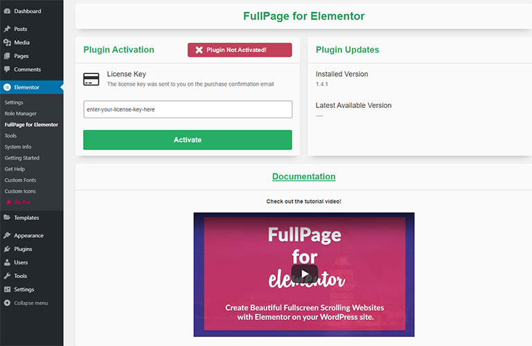

After entering the license, press on `Activate` button. This will activate the license.

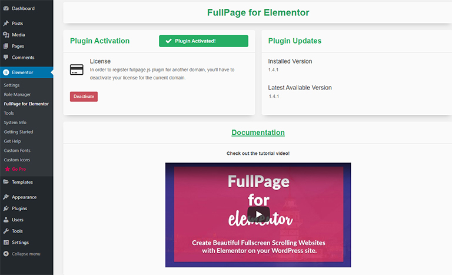

You can use the plugin without any limitations once your license is activated.

### License Deactivation

If you want to move your license to another domain, you will need to deactivate your license if activated. You can click on the `Deactivate` button to deactivate your license.

<iframe width="560" height="315" src="https://www.youtube.com/embed/dZ4xvky-VfU" frameborder="0" allow="accelerometer; autoplay; encrypted-media; gyroscope; picture-in-picture" allowfullscreen></iframe>

If you don't have access to your site, you can deactivate your license on the <a href="https://www.meceware.com/server/deactivate-fullpage/" target="_blank">deactivation page</a>.

### License Dashboard

If you want to see all your licenses, please visit the <a href="https://alvarotrigo.com/fullPage/dashboard/" target="_blank">dashboard</a>.

## Sample Elementor Template

You can [download the Elementor template file](/template/fullpage-for-elementor-template.json) and load it via Elementor Template Library.

To load the template:
* Create a new post/page with Elementor.
* Click the Add Template From Library icon.

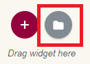

* Click the Import Templates button.

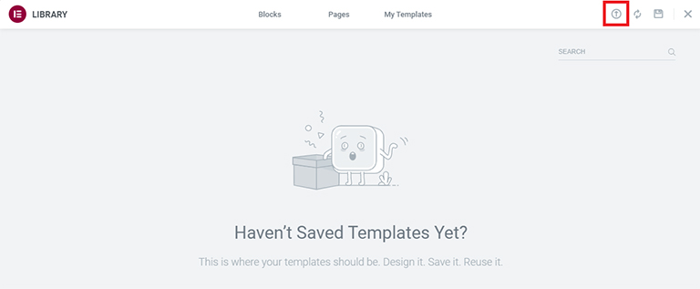

* Drag and drop the `fullpage-for-elementor-template.json` file to import it.

* Insert the template to the page and save the page.

## Enable FullPage

* Create a new post/page with Elementor.
* Click on `Settings` button. You will see `FullPage` tab.
* Go to `FullPage` tab.
* Toggle `Enable FullPage` option.
* Wait for the page preview to refresh.

*Note: Each content should be inside Elementor Section widgets. Only the contents inside the sections will be rendered and other content may break the script.*

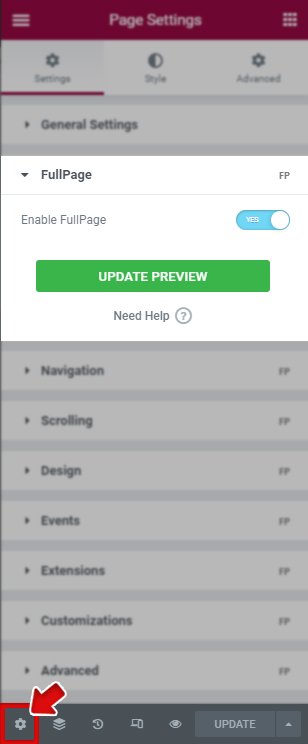

## Sections

Each Elementor Section widget or top Container widget on the page is defined as fullpage section.

### Add Sections

Drag and drop any Elementor widget inside the widget drop area, or click on the plus sign.

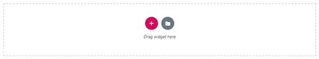

Every time a widget is added, a new section is created. You can check the sections via `Navigator`.

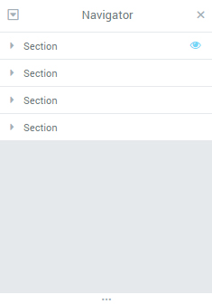

### Remove Sections

* Right click on the section/container widget and click on `Delete`.

### Section Options

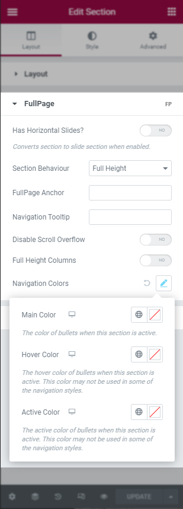

#### Has Horizontal Slides

This option enables the specified section as horizontal slides container.

#### Section Behaviour

This option defines the behaviour of the section.

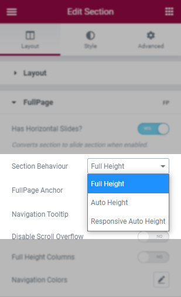

When `Full Height` is selected, the height of the sections will be full screen.

When `Auto Height` is selected, the height of the section will take the height defined by your section/slide content.

When `Responsive Auto Height` is selected, sections will be full screen until the responsive mode gets fired. Then they'll take the size required by their content, which could be bigger or smaller than the viewport.

#### FullPage Anchor

If you are using FullPage with anchor links for the sections, then you will be able to use anchor links also to navigate directly to a certain slide inside a section.

This would be an example of a link with an anchor:
`http://yoursite.com/#secondPage`
(which is the URL you will see once you access to that section manually) Notice the last part of the URL ends in `#secondPage`, if FullPage Anchor option for that section is set to `secondPage`.

By default, uniquely generated anchors are used.

*Note: FullPage Anchor should be a unique ID and should NOT be the same with any anchor ID on the page.*

#### Navigation Tooltip

This option defines the tooltips to show for the navigation bullets in case they are being used.

#### Disable Scroll Overflow

This option is used to prevent creating the scrollbar in certain sections or slides. Enable this option when [Scroll Overflow](#scroll-overflow) is enabled but the scrollbars in this section is not needed.

#### Full Height Columns

This option makes the column height same with section height.

#### Navigation Colors

If you want to change the (left/right) navigation bullet colors for the active section, you can change the colors using these options. This will override the navigation colors only on the selected section.

## Slides

Slides are the horizontal FullPage elements inside fullpage sections.

Each `Inner Section` or `Container` widget inside the Elementor Sections or top `Container` Widget are set as FullPage Slides if [*Has Horizontal Slides*](#has-horizontal-slides) option of the section is enabled.

*Note: When a section is enabled as a Slide, only Inner Section or Container widgets can be placed inside the fullpage section. No other widgets should be placed inside the section other than Inner Section or Container.*

### Add Slides

* Enable [*Has Horizontal Slides*](#has-horizontal-slides) option of the section.
* Add `Inner Section` widgets inside the section, or `Container` widgets inside the top container.
* Add your content inside the `Inner Section` or `Container` widgets.

### Remove Slides

* Remove the `Inner Section` or `Container`.

### Slide Options

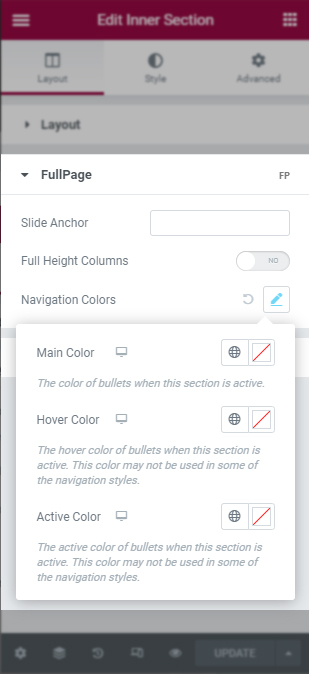

If a custom anchor is needed for a slide instead of its index, you can enter the new slide anchor to `Slide Anchor` option. If set, the anchor of the slide will be `#section_anchor/slide_anchor`. If this option is left empty, the anchor of the slide will be `#section_anchor/2` where 2 is the slide number.

For Full Height Columns, see [this section](#full-height-columns).

For Slide Navigation Colors, see [this section](#navigation-colors).

## Navigation

Navigation section includes the options about section and slide navigation.

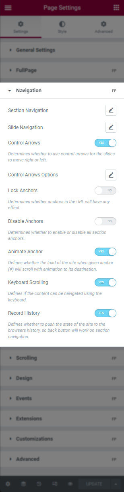

### Section Navigation

Section navigation includes the options of the navigation bar made up of small circles (bullets).

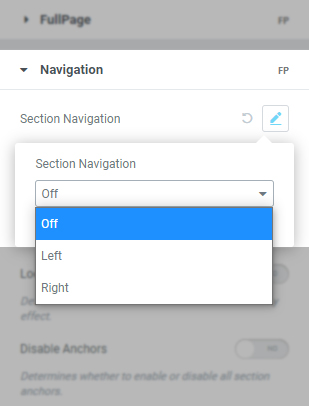

**Options**
* `Left`: The navigation bullets for the section navigation will be shown at the left side of the page.
* `Right`: The navigation bullets for the section navigation will be shown at the right side of the page.

When an option is selected, `Section Navigation Options` will be activated.

* `Section Navigation Style`: You can select the navigation bullet style with this option.
* `Show Active Tooltip`: When this option is enabled, the tooltip for the active section will be visible next to the navigation bullet.
* `Clickable Tooltip`: When this option is enabled, the tooltip clicks also go to the corresponding section.
* `Bigger Navigation`: You can enable this option to see bigger navigation bullets.

Responsive options can be configured for the selected device (desktop, tablet and mobile devices).

* `Show`: You can show or hide the navigation bullets with this option responsively.
* `Main Color`: You can choose the primary color of the bullets.
* `Hover Color`: You can choose the primary color of the bullets when mouse is on the bullets.
* `Active Color`: You can choose the primary color when the section bullet is active.
* `Tooltip Background Color`: You can choose the background of the tooltips.
* `Tooltip Text Color`: You can choose the text color of the tooltips.
* `Space`: You can specify the distance from left/right of navigation bullets using this option.

### Slide Navigation

Slide navigation includes the options of the navigation bar made up of small circles (bullets) for slides.

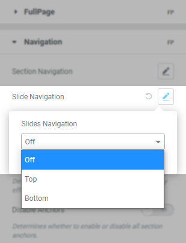

**Options**
* `Top`: The navigation bullets for the slide navigation will be shown at the top side of the section.
* `Bottom`: The navigation bullets for the slide navigation will be shown at the bottom side of the section.

When an option is selected, `Slide Navigation Settings` will be activated.

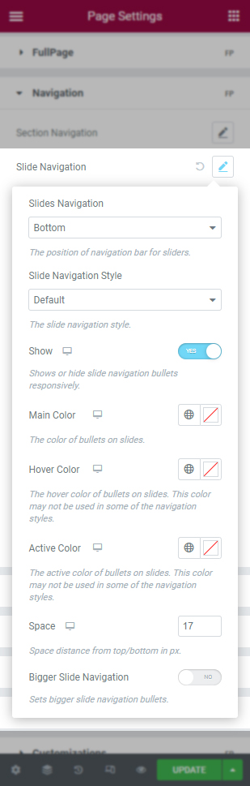

* `Slide Navigation Style`: You can select the navigation bullet style with this option.
* `Bigger Slide Navigation`: You can enable this option to see bigger navigation bullets.

Responsive options can be configured for the selected device (desktop, tablet and mobile devices).

* `Show`: You can show or hide the slide navigation bullets with this option responsively.
* `Main Color`: You can choose the primary color of the bullets.
* `Hover Color`: You can choose the primary color of the bullets when mouse is on the bullets.
* `Active Color`: You can choose the primary color when the slide bullet is active.
* `Space`: You can specify the distance from top/bottom of slide navigation bullets using this option.

### Control Arrows

This option determines whether to use control arrows for the slides to move right or left.

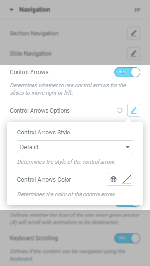

* `Control Arrows Style`: The style of the control arrows.
* `Control Arrows Color`: The color of the control arrows.

### Lock Anchors

This option determines whether anchors in the URL will have any effect at all in the library.

### Disable Anchors

This parameter determines whether to enable or disable all section anchors.

### Animate Anchor

This option defines whether the load of the site when given an anchor (#) will scroll with animation to its destination or will directly load on the given section.

### Keyboard Scrolling

This option defines if the content can be navigated using the keyboard.

### Record History

This option defines whether to push the state of the site to the browser's history. When enabled, each section/slide of the site will act as a new page and the back and forward buttons of the browser will scroll the sections/slides to reach the previous or next state of the site. When disabled, the URL will keep changing but will have no effect on the browser's history. This option is automatically disabled when [*Auto Scrolling*](#auto-scrolling) option is disabled.

## Scrolling

Scrolling section includes the options about scrolling mechanism.

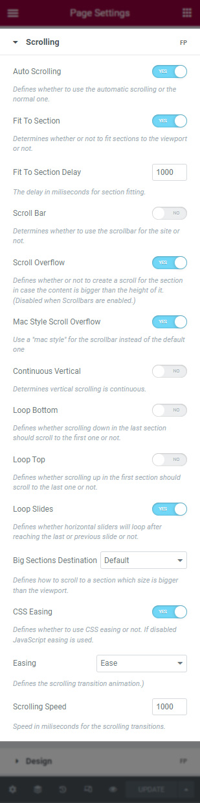

### Auto Scrolling

This option defines whether to use the automatic scrolling or the normal one. It also has affects the way the sections fit in the browser/device window in tablets and mobile phones.

### Fit To Section

This option determines whether or not to fit sections to the viewport or not. When set to true the current active section will always fill the whole viewport. Otherwise the user will be free to stop in the middle of a section.

### Scroll Bar

This option determines whether to use scrollbar for the site or not. In case of using scroll bar, the [Auto Scrolling](#auto-scrolling) functionality will still work as expected. The user will also be free to scroll the site with the scroll bar and FullPage will fit the section in the screen when scrolling finishes.

### Scroll Overflow

This option defines whether or not to create a scroll for the section/slide in case its content is bigger than the height of it.

`Mac Style Scroll Overflow` option enables a "mac style" for the scrollbar instead of the default one, which will look quite different in Windows computers.

### Continuous Vertical

This option defines whether scrolling down in the last section or should scroll down to the first one and if scrolling up in the first section should scroll up to the last one.

### Loop Bottom

This option defines whether scrolling down in the last section should scroll to the first one or not.

### Loop Top

This option defines whether scrolling up in the first section should scroll to the last one or not.

### Loop Slides

This option defines whether horizontal sliders will loop after reaching the last or previous slide or not.

### Big Sections Destination

This option defines how to scroll to a section which size is bigger than the viewport. By default FullPage scrolls to the top if you come from a section above the destination one and to the bottom if you come from a section below the destination one. Possible values are top, bottom, default.

### Easing

This option defines the transition effect to use for the vertical and horizontal scrolling. It includes CSS3 or JS transition effects.

When `CSS Easing` option is enabled, CSS3 transition animations are used. It is highly recommended to use CSS3 easing options.

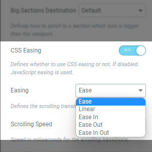

When `CSS Easing` option is disabled, JavaScript transition animations are used.

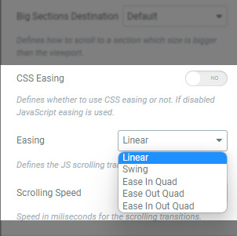

### Scrolling Speed

Speed in milliseconds for the scrolling transitions.

## Design

Design section includes options about the elements of fullpage.

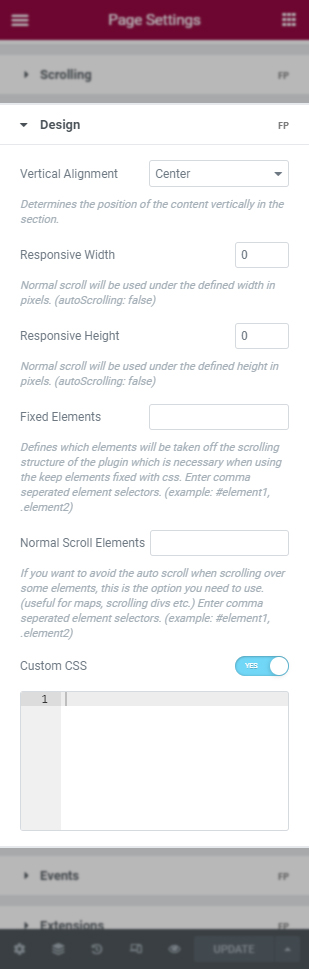

### Vertical Alignment

This option defines vertical position of the content within sections.

### Responsive Width

A normal scroll will be used under the defined width in pixels. A class `fp-responsive` is added to the body tag in case the user wants to use it for their own responsive CSS. For example, if set to 900, whenever the browser's width is less than `900` the plugin will scroll like a normal site.

### Responsive Height

A normal scroll will be used under the defined height in pixels. A class `fp-responsive` is added to the body tag in case the user wants to use it for their own responsive CSS. For example, if set to 900, whenever the browser's height is less than `900` the plugin will scroll like a normal site.

### Fixed Elements

This option defines which elements will be taken off the scrolling structure of the plugin which is necessary when using the CSS3 option to keep them fixed. It requires a string with the JavaScript selectors for those elements. (For example: `#element1, .element2`)

### Normal Scroll Elements

If you want to avoid the auto scroll when scrolling over some elements, this is the option you need to use. (useful for maps, scrolling elements etc.) It requires a string with the JavaScript selectors for those elements. (For example: `#element1, .element2`). This option should not be applied to any section/slide element itself.

### Custom CSS

You can add your FullPage related custom CSS. This CSS will only be enabled when FullPage is enabled.

## Events

Events section includes JavaScript events for the plugin.

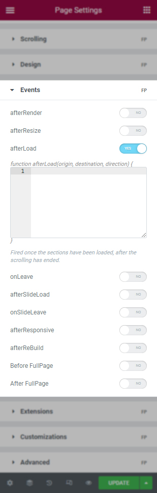

### afterRender

This callback is fired just after the structure of the page is generated. This is the callback you want to use to initialize other plugins or fire any code which requires the document to be ready (as this plugin modifies the DOM to create the resulting structure).

### afterResize

This callback is fired after resizing the browser window. Just after the sections are resized.

### afterLoad

This callback is fired once the sections have been loaded, after the scrolling has ended.

### beforeLeave

This callback is fired right before leaving the section, just before the transition takes place. Returning false will cancel the move before it takes place.

### onLeave

This callback is fired once the user leaves a section, in the transition to the new section. Returning false will cancel the move before it takes place.

### afterSlideLoad

This callback is fired once the slide of a section have been loaded, after the scrolling has ended.

### onSlideLeave

This callback is fired once the user leaves an slide to go to another, in the transition to the new slide. Returning false will cancel the move before it takes place.

### onScrollOverflow

This callback gets fired when a scrolling inside a scrollable section and [Scroll Overflow](#scroll-overflow) is enabled.

### afterResponsive

This callback is fired after fullpage changes from normal to responsive mode or from responsive mode to normal mode.

### afterReBuild

This callback is fired after manually re-building fullpage.js by calling `fullpage_api.reBuild()`.

### Before FullPage

This callback is fired right before initializing fullpage.js.

### After FullPage

This callback is fired right after initializing fullpage.js.

## Extensions

Extensions section includes FullPage Extension options. The extensions can be purchased on <a href="https://alvarotrigo.com/fullPage/extensions/" target="_blank">FullPage Extensions</a> page.

***Note: These options are only available if at least one extension is purchased. The plugin is not bundled with these extensions.***

***Note: After you purchase an extension, the extension can be installed using your extension license key and used without activation. Please note that, there is no deactivation or domain change for extensions.***

### Installing The Extension

- Go to `FullPage for Elementor` settings page. You will see extension list.

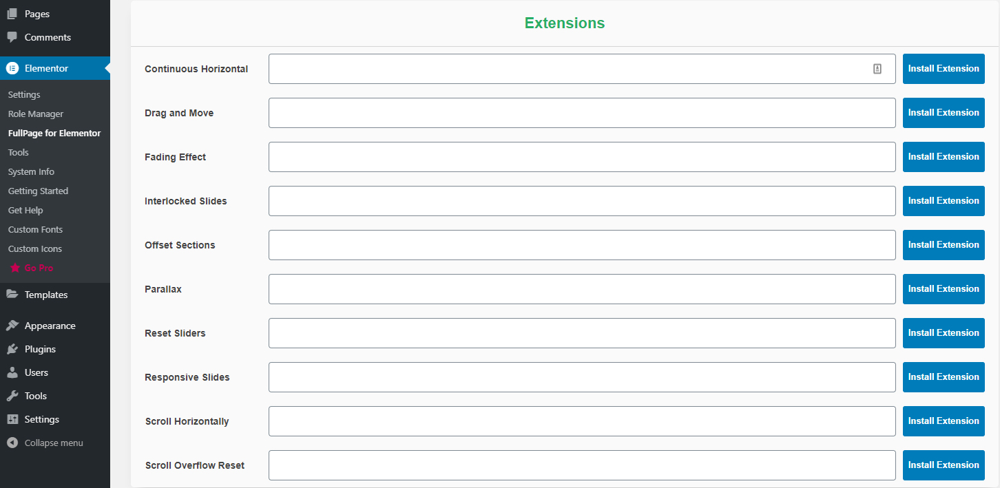

- Enter your *License Key* you've received via email upon the purchase for the corresponding extension.

- Click on `Install Extension` button for the corresponding extension.

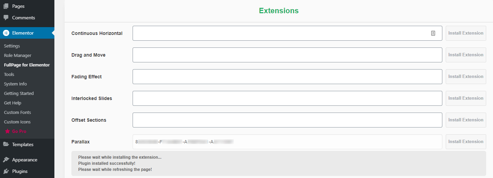

- After a successfull installation, the page will refresh and the extension plugin should be installed.

### Activating The Extension

When you purchase an extension, you will need to activate your extension license for a domain. **Please note that, there is no deactivation or domain change for extensions**.

You can use the extension without activating it on a domain (for example, a staging/development domain). ***When a non-activated extension is used on a domain, a red box will appear but it will be removed upon activation***.

If you are on a staging/development domain, please ignore that message and do not activate for the development domain. **The extension domain cannot be changed (no deactivation) and once activated, refund for the extension would not be possible**. Once moved to the production domain, you can activate it and the red box will be disappeared automatically.

If this is the first time you are using the extension (*hence the extension license is not activated*), you will see an orange box about the activation process after installing the extension plugin.

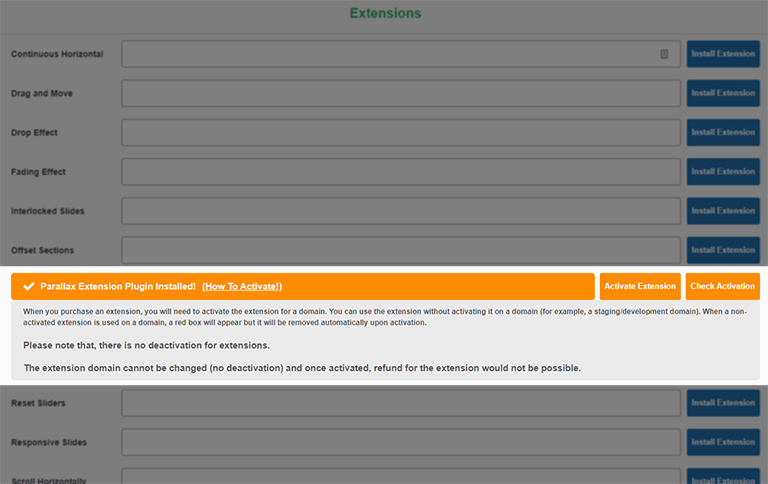

If you are on the production domain and you want to activate your license, click on `Activate Extension` button and follow the steps on the activation page.

Once the activation process is completed, click on `Check Activation` button and the extension should be activated. ***The activation key is fetched automatically***.

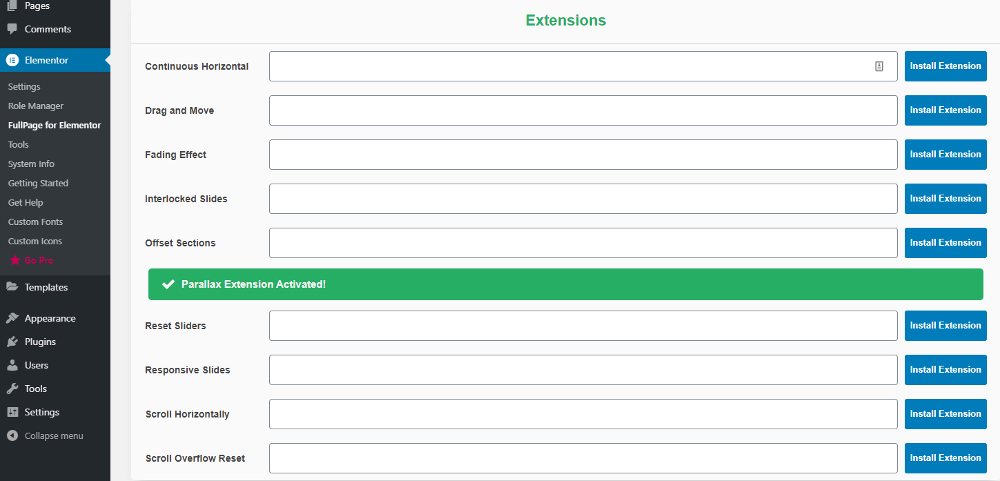

If you don't like the automatic activation process and you want to manually activate your license, go to the <a href="https://alvarotrigo.com/fullPage/extensions/activationKey.html">activation web site</a> and follow the on-screen steps to choose your extension and enter your *License Key* you've received via email upon the purchase.

### Using The Extension

After the extension is installed,

- Enable `Enable FullPage Extensions` option under Extensions tab of FullPage options.

- You should see the extension. Enable the corresponding extension and adjust its option(s) as suitable.

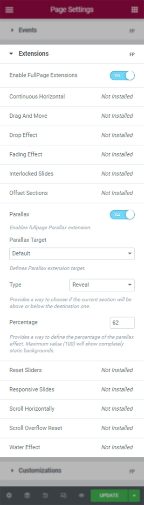

### Removing the Extension

To remove the extension, go to your Plugins page and Deactivate/Delete the extension plugin.

## Customizations

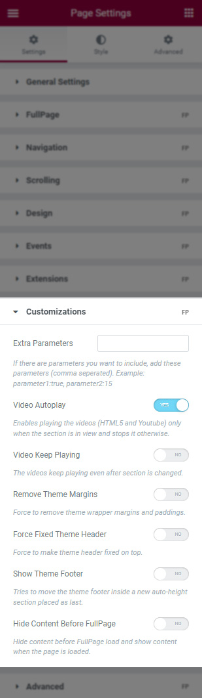

### Extra Parameters

If needed, any extra fullpage.js parameters can be used.

### Video Autoplay

If the page has video(s) in sections/slides, this parameter will make the videos play when the section is visible, otherwise pauses on section leave.

`Video Keep Playing` option will make the videos play all the time, even if the section/slide is not in the view.

### Remove Theme Margins

This option tries to remove the page wrapper margins, so the page can be full width.

### Force Fixed Theme Header

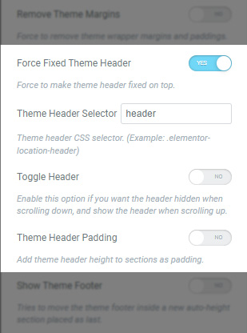

This option tries to make the header fixed at the top, and arranges the section content accordingly.

`Theme Header Selector` option should be given as a JavaScript/CSS selector.

`Toggle Header` option enables header toggle, which the header is hidden when scrolling down, and the header is shown when scrolling up.

`Theme Header Padding` option sets the section header paddings with respect to header height.

If you designed your theme header using Elementor, the *Theme Header Selector* option should be set to `.elementor-location-header`.

### Show Theme Footer

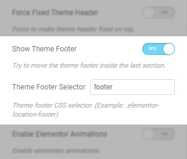

This option moves the footer inside a new auto-height section placed as last.

`Theme Footer Selector` option should be given as a JavaScript selector.

### Hide Content Before FullPage

When this option is enabled, an empty content will be shown before FullPage is loaded. The content is shown after FullPage is loaded and enabled.

## Advanced

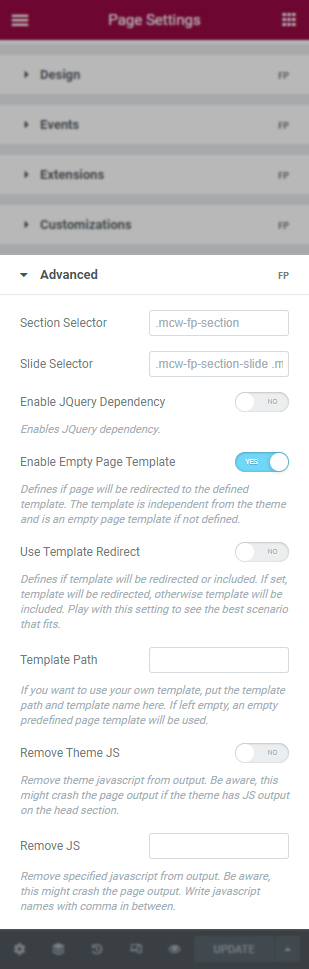

### Section Selector

If needed, the JavaScript selector of the sections can be given here.

### Slide Selector

If needed, the JavaScript selector of the slides can be given here.

### Enable JQuery Dependency

FullPage does not depend on jQuery. But if you want to load jQuery on the page (if not loaded already), enable this option.

### Enable Empty Page Template

<iframe width="560" height="315" src="https://www.youtube.com/embed/VORmJRSs_fQ" frameborder="0" allow="accelerometer; autoplay; encrypted-media; gyroscope; picture-in-picture" allowfullscreen></iframe>
 

This option enables Empty Page Template option. By default FullPage for Elementor comes with an empty page template, and this option is enabled. When FullPage is enabled, an empty page with no theme dependency is loaded.

You can disable this option and load theme template. When this option is disabled, theme header and footer is loaded as well. You might need to know CSS and JavaScript to change the behaviour of the page.

### Use Template Redirect

This parameter defines if template will be redirected or included. If set, template will be redirected, otherwise template will be included. Play with this setting to see the best scenario that fits. This option is enabled only when Empty Page Template is used.

### Template Path

You can provide your own template, such as a modified version of the theme template. If you want to use your own template, put the template path here. If left empty, the empty predefined page template will be used.

### Remove Theme JS

This parameter removes theme JavaScript files from output. Be aware, this might crash the page output if the theme has JS output on the head section.

Enable this option if you want to remove theme JavaScript files, on necessary cases such as conflicts between theme and FullPage. Enabling this option is not recommended on production environments, and is used for debugging purposes.

### Remove JS

This parameter removes specified JavaScript file from output. Be aware, this might crash the page output. Write JavaScript names with comma in between.

## FAQ

#### Can I move my license to another server?

Yes, you can! You can *deactivate* your license on your old server and use the same license on your new server. Don't forget to *Deactivate*. Please see [License Key](#license-key "License Key") section for more information.

#### How can I deactivate my license if I don't have access to my site?

You can manage your licenses on the <a href="https://alvarotrigo.com/fullPage/dashboard/" target="_blank">dashboard</a>.

Alternatively, you can *deactivate* your license on the <a href="https://www.meceware.com/server/deactivate-fullpage/" target="_blank">deactivation page</a>. You will need the domain of your site, your license key and your email you used to purchase the plugin.

#### How can I generate the invoice for the plugin?

You would have received an email from Gumroad that shows the plugin license key as well as an *Invoice* button. You can generate your invoice by clicking on that button.

#### I cannot see extensions even if I installed the Extensions plugin!

FullPage extensions can be purchased separately and is not available with the plugin out-of-the-box. If you haven't purchased any extension, you don't need to use/activate the extensions plugin.

If you have purchased one or more extensions, please take a look at the [Extensions](#extensions "Extensions") section for the tutorial video that shows how to install them.

#### I see a red box about extension not activated!

Please find more information at [Extensions](#extensions "Extensions") part of the documentation. As specified there, you could see the red box when the extension is not activated. However, if you are on a development domain, **please ignore that message and do not activate for the development domain**. **The extension domain cannot be changed and once activated, refund for the extension would not be possible**. Once moved to the production domain, you can activate it and the red box will be disappeared automatically.

#### How can I show a normal web site on mobile and fullpage scrolling web site on desktop?

You can activate Responsive Mode. To activate Responsive Mode, please set [Responsive Width](#responsive-width "Responsive Width") option to `767` (or any screen width you want). That's it! For the screens that has width less than `767px`, a normal scrolling web site will be shown.

You can also try setting [Responsive Auto-Height](#section-behaviour "Section Behaviour") option for the sections.

#### I cannot see my header and footer!

By default, the plugin comes with an empty page template. This means that, while fullPage is enabled on your WordPress site, an empty page with no theme dependency will be loaded. That's why your header or footer does not appear on your site. To disable it, please take a look at the [tutorial video](#enable-empty-page-template "Enable Empty Page Template").

#### I cannot scroll to my footer!

If scrollbars are disabled, only the content inside the sections are visible. To be able to show the footer, it needs to be moved inside a section. You can use the [Show Theme Footer](#show-theme-footer "Show Theme Footer") customization.

#### Sections are getting cut off! I cannot see the rest of my content!

When the scrollbars are disabled and your content is greater than the screen height, some of your content might be left outside of the viewport. To display these, you can enable [Scroll Overflow](#scroll-overflow "Scroll Overflow") option. This will create an in-section scrollbar.

#### How do I remove anchors from URL?

If you want to remove the anchors (your-domaion.com/`#anchor`), you can enable [Lock Anchors](#lock-anchors "Lock Anchors") or [Disable Anchors](#disable-anchors "Disable Anchors") option. Enabling one of these two options will remove the anchor part from the URL.

#### Why my scroll based animations or events don't work?

Some of the WordPress plugins or Javascript libraries that depend on scrolling mechanism such as sticky menus, animations etc. might not work if scroll bar is disabled using the plugin. Please enable the [Scroll Bar](#scroll-bar "Scroll Bar") option to enable scroll based animations.

#### Updating From v1.X to v2.0

FullPage for Elementor plugin has a major update that changes a lot of things under the hood! To update the plugin from `v1.X` to `v2.X`, please follow the instructions below:

- Before updating, please take a **database backup** as a precaution.

- Update FullPage for Elementor plugin to the latest version.

- For each page/post designed with FullPage for Elementor (FullPage is enabled):

  - Edit the page/post.

  - Check [Easing](#easing) option under [Scrolling tab](#scrolling) of FullPage options. If you used a different CSS easing before, please check the option if it’s the correct one. If you used a JS easing on your site (for fixed background images as an example), please disable `CSS Easing` option and select the correct option from `Easing` option.

  - `Top` and `Bottom` options are removed from [Vertical Alignment](#vertical-alignment) under [Design tab](#design) of FullPage options. Instead `Default` option can be selected and vertical alignment can be adjusted from Elementor section options. Please check the vertical alignment of sections.

  - For Offset Section extension users, if you have changed the default option of `Data Centered` option for any section, please update it again to the correct value. This option can be found under FullPage option for each section.

  - For users that have custom CSS or JavaScript options, please check your site after the update. You can use [support](/contact "Contact") for your customized scripts and styles.

  - Save the page and refresh. After saving, you should not see any error.

  - Check your page to test if everything works as expected.

- That should be it :) For any issues, please use [support](/contact "Contact") and we will try our best to help you…
