Create beautiful fullscreen scrolling web sites with **WordPress** and **Gutenberg**, fast and simple.

[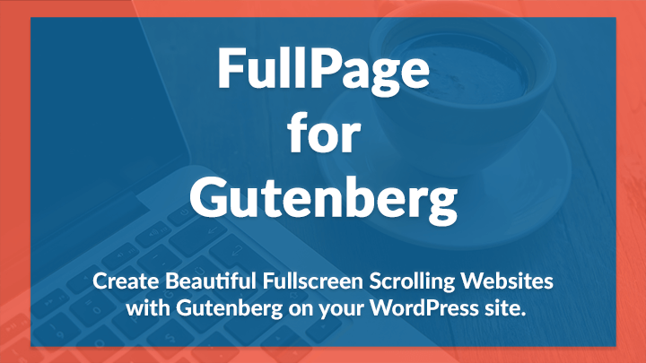](https://alvarotrigo.com/fullPage/wordpress-plugin-gutenberg/)

<a class="button" target="_blank" href="/fullpage-for-gutenberg/">DEMO</a><a class="button" target="_blank" href="https://gum.co/fullPageForGutenberg">BUY</a><a class="button" href="#faq">FAQ</a>

This plugin simplifies creation of fullscreen scrolling websites with WordPress and saves you big time.

<iframe width="560" height="315" src="https://www.youtube.com/embed/vfl-gI3UsxY" frameborder="0" allow="accelerometer; autoplay; encrypted-media; gyroscope; picture-in-picture" allowfullscreen></iframe>

## Top Features

* **Responsive**

  FullPage is fully responsive and perfect fit for any device.

* **Touch Support**

  For mobiles, tablets and other touch screen devices.

* **Sections/Slides**

  You can easily add sections and slides by clicking a button, and design your content anyway you'd want with Gutenberg.

* **Auto-Height Sections**

  Each section can be defined as auto-height instead of full height.

* **Responsive Auto-Height Sections**

  Full height sections for big screens and auto height sections for small screens.

* **Background Videos**

  Use self-hosted videos as well as YouTube and Vimeo videos as section and slide backgrounds, including color and background image overlay options available.

* **Navigation Bullets**

  Horizontal and vertical navigation bullets with 19 different styles.

* **Animations**

  5 CSS3 ease animations or 32 JavaScript animations, whichever you prefer.

* **Anchors**

  Animated anchor links, optional browser history support and optional anchor links at the address bar.

* **Keyboard Navigation**

  Navigate between sections and slides with keyboard.

* **Vertically Aligned Sections**

  Align your content vertically (top, middle, bottom) in the sections.

* **Section and Slide Loops**

  Infinite loop options for sections and slides.

* **Scrollbars**

  Full page scroll with optional scrollbar, either regular scrollbar or in-section scroll bar.

* **Clean and Minimized Code**

  Clean, professionally written, optimized and minimized code.

* **Minimal Server Code**

  The server side code is minimized and scripts are loaded when necessary.

* **Templates**

  Use empty page template by default, use your own template, or use the theme template (might need JavaScript and CSS skills)

* **Auto-Updates**

  Notify and update the plugin when there is an update available automatically.

## Requirements

* WordPress version should be at least 5.1.
* Gutenberg should be active on the WordPress site.

## Tutorial Video

<iframe width="560" height="315" src="https://www.youtube.com/embed/ofAoLMtGE20" frameborder="0" allow="accelerometer; autoplay; encrypted-media; gyroscope; picture-in-picture" allowfullscreen></iframe>

 

<iframe width="560" height="315" src="https://www.youtube.com/embed/No-92vhin2w" frameborder="0" allow="accelerometer; autoplay; encrypted-media; gyroscope; picture-in-picture" allowfullscreen></iframe>

## How To Install

* Login to your WordPress Dashboard.
* In your WordPress Admin Menu, go to **Plugins > Add New**.
* Click on **Upload Plugin** button found on top left corner of page.
* Click on **Browse** button. Select the `.zip` file of your plugin in your computer, and click **Install Now** button.
* Active the plugin by clicking on **Activate Plugin** link to work with the plugin.

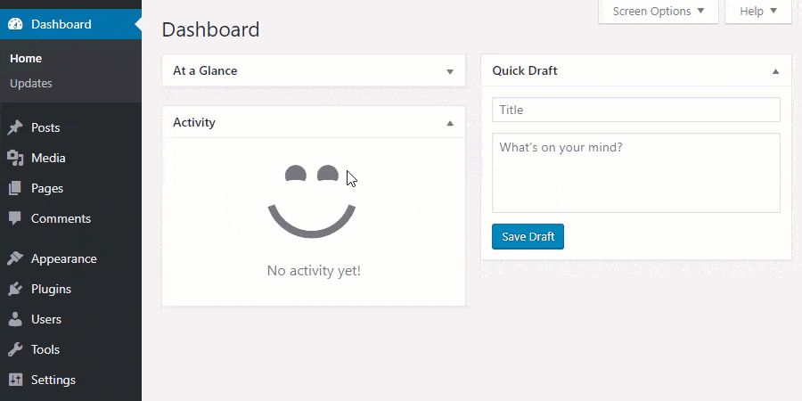

## Add The Block With Gutenberg

* Create a new post/page or go to the post/page you would like to add the block.
* Find **FullPage for Gutenberg** block on the Gutenberg blocks and add it to the page.

*Note: You can add only one **FullPage for Gutenberg** block. You should not add any other blocks to the page (unless you know what you are doing) since only the contents inside **FullPage for Gutenberg** block will be rendered and other content may break the script.*

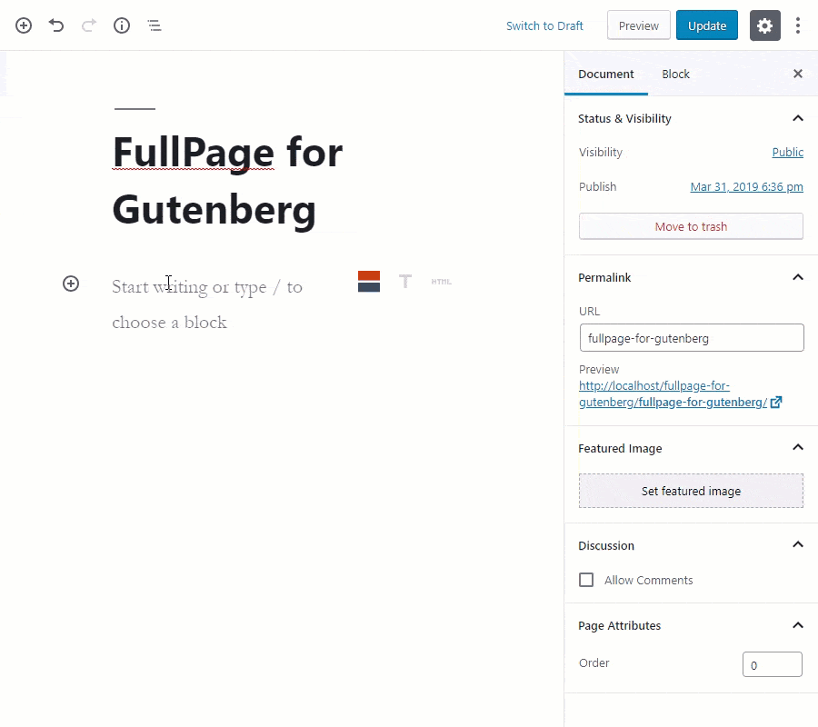

## Enable FullPage

* Click on **FullPage for Gutenberg** block. You will see its settings on the right side of Gutenberg editor.
* Toggle **Enable FullPage** option.

## License Key

The license key you obtained by buying the plugin can be entered at WordPress admin panel FullPage for Gutenberg settings page.

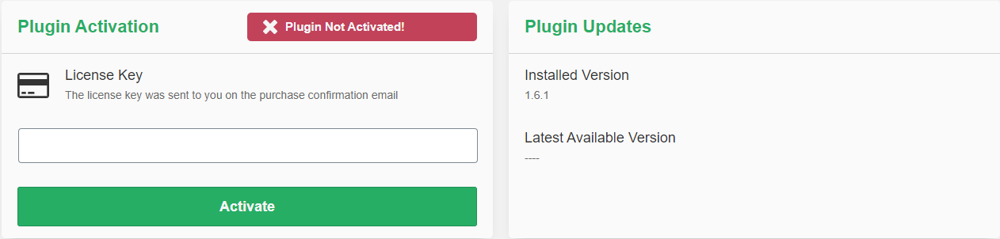

After entering the license, press on *Activate* button. This will activate the license.

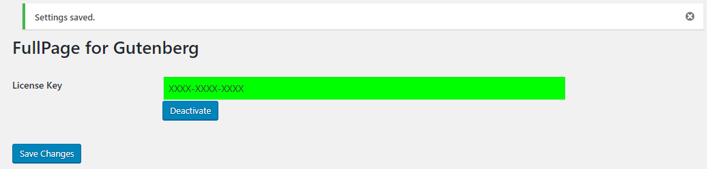

You can use the plugin without any limitations once your license is activated.

### License Deactivation

If you want to move your license to another domain, you will need to deactivate your license if activated. You can click on the *Deactivate* button to deactivate your license.

## Sections

When **FullPage for Gutenberg** block is added to the page, two sections are added by default.

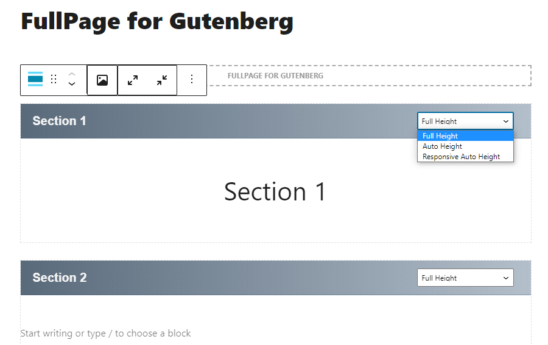

### Add Sections

* Click on Add Section button at the bottom of **FullPage for Gutenberg** block.

### Remove Sections

* Click on the *More Options* menu dots in the top navbar and click *Remove Block*.

### Add Section Content

* Click inside the section block and add Gutenberg blocks inside the section block. You can add anything inside the section block.

### Section Options

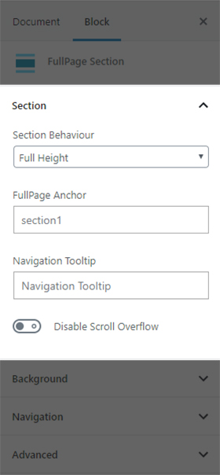

#### Section Behaviour

This option defines the behaviour of the section.

When *Full Height* is selected, the height of the sections will be fullscreen.

When *Auto Height* is selected, the height of the section will take the height defined by your section/slide content.

When *Responsive Auto Height* is selected, sections will be fullscreen until the responsive mode gets fired. Then they'll take the size required by their content, which could be bigger or smaller than the viewport.

#### FullPage Anchor

If you are using FullPage with anchor links for the sections, then you will be able to use anchor links also to navigate directly to a certain slide inside a section.

This would be an example of a link with an anchor:
`http://yoursite.com/#secondPage`
(which is the URL you will see once you access to that section manually) Notice the last part of the URL ends in `#secondPage`, if FullPage Anchor option for that section is set to `secondPage`.

#### Navigation Tooltip

This option defines the tooltips to show for the navigation circles in case they are being used.

#### Disable Scroll Overflow

This option is used to prevent fullpage.js from creating the scrollbar in certain sections or slides. When Scroll Overflow is enabled but the scrollbars in this section is not needed, enable this option.

### Section Background Options

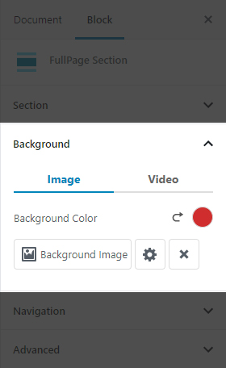

These group of options define the background color, background image and background video options for the specified section.

#### Section Background Color

To choose the background color, click on the color circle and choose the desired section background color. To clear the color, click on the revert arrow icon next to the color circle.

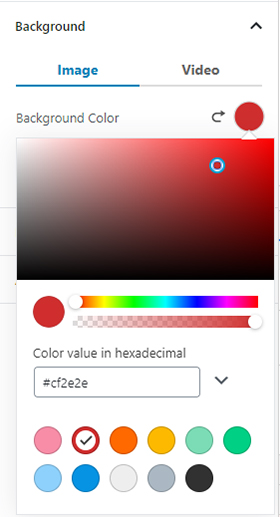

#### Section Background Image

To choose the background image, click on the *Background Image* button and select the image from media library. Click on the cog button to choose the background image options.

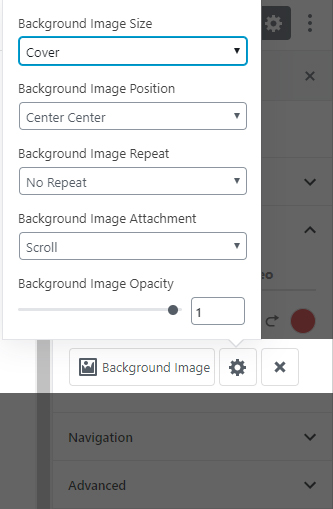

#### Section Background Video

To choose the background video, click on the *Video* tab to see the video parameters. The background color indicates the video overlay color. Poster image is the image that is shown while the video is downloaded until playing the video.

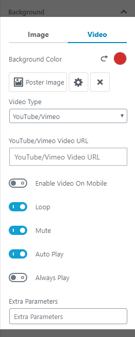

Enable *Enable Video On Mobile* option to play the video on mobile devices. If this option is disabled, the video will NOT be loaded on mobile devices. Only poster image will be displayed. Disabling this option is best practice.

To loop the video, enable *Loop* option.

The mute the video sound, enable *Mute* option.

When *Auto Play* option is enabled, the video will be played as soon as it's playable.

When *Always Play* option is enabled, the video plays even if the section is not active. When disabled, the video only plays if the section is active, otherwise the video is paused. This option does not work with Vimeo videos.

To use a Youtube or Vimeo video, simply put the video link inside *YouTube/Vimeo Video URL* option.

To use self-hosted videos, *Self-Hosted* from *Video Type* option and select mp4, ogv/ogg (optional) and webm (optional) videos from media library.

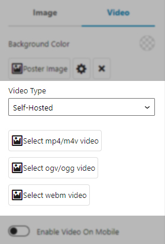

### Section Navigation Options

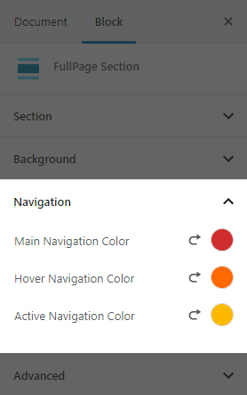

If you want to change the (left/right) navigation bullet colors for the active section, you can change the colors using these options. This will override the navigation colors only on the selected section.

## Slides

Slides are the horizontal FullPage elements inside sections.

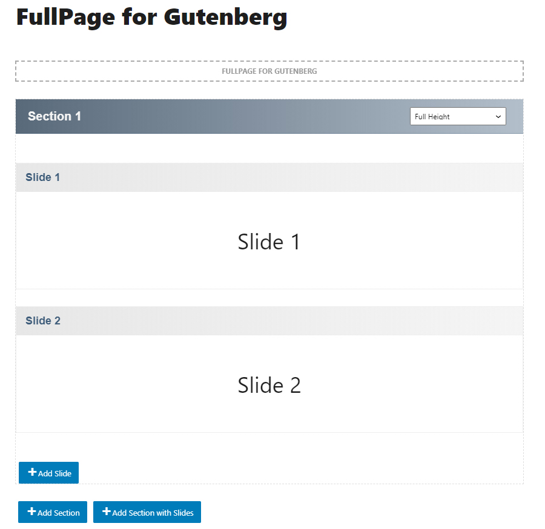

### Add Slides

* Click on *Add Section with Slides* button at the bottom of **FullPage for Gutenberg** block. When section with slides block is added to the section, two slides are added by default.
* Click on *Add Slide* button to add more slides.

### Remove Slides

* Click on the *More Options* menu dots in the top navbar and click *Remove Block*.

### Add Slide Content

* Click inside the slide block and add Gutenberg blocks inside the slide block. You can add anything inside the slide block.

### Slide Options

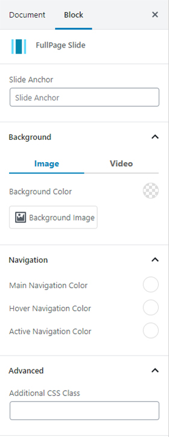

The anchor at the end of the URL `#secondPage/2` defines the section and slide of destination respectively. In the previous URL, the section of destination will be the one defined with the anchor secondPage and the slide will be the 2nd slide, as we are using the index 2 for it. (the fist slide of a section has index 0, as technically it is a section).

If a custom anchor is needed for a slide instead of its index, you can enter the new slide anchor to *Slide Anchor* option.

For Slide Background options, see [this section](#section-background-options).

For Slide Navigation options, see [this section](#section-navigation-options).
## Navigation

Navigation section includes the options about section and slide navigation.

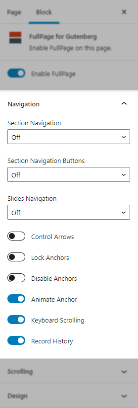

### Section Navigation

Section navigation includes the options of the navigation bar made up of small circles (bullets).

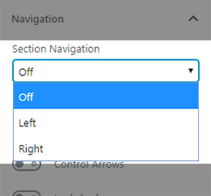

**Options**
* *Left*: The navigation bullets for the section navigation will be shown at the left side of the page.
* *Right*: The navigation bullets for the section navigation will be shown at the right side of the page.

When an option is selected, **Section Navigation Settings** button will be activated.

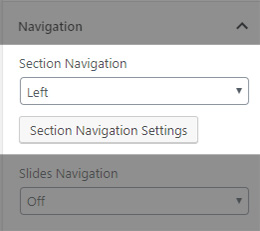

You can access the bullet options when you click on **Section Navigation Settings** button.

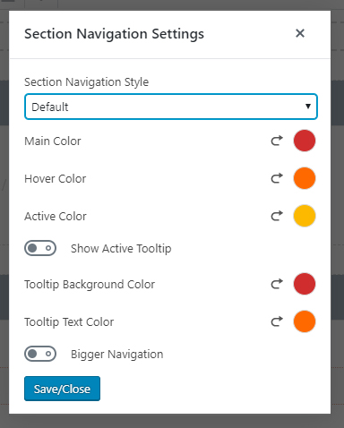

* *Section Navigation Style*: You can select the navigation bullet style with this option.
* *Main Color*: You can choose the primary color of the bullets.
* *Hover Color*: You can choose the primary color of the bullets when mouse is on the bullets.
* *Active Color*: You can choose the primary color when the section bullet is active.
* *Show Active Tooltip*: When this option is enabled, the tooltip for the active section will be visible next to the navigation bullet.
* *Tooltip Background Color*: You can choose the background of the tooltips.
* *Tooltip Text Color*: You can choose the text color of the tooltips.
* *Bigger Navigation*: You can enable this option to see bigger navigation bullets.

### Slide Navigation

Slide navigation includes the options of the navigation bar made up of small circles (bullets) for slides.

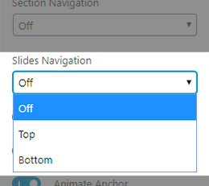

**Options**
* *Top*: The navigation bullets for the slide navigation will be shown at the top side of the section.
* *Bottom*: The navigation bullets for the slide navigation will be shown at the bottom side of the section.

When an option is selected, **Slide Navigation Settings** button will be activated.

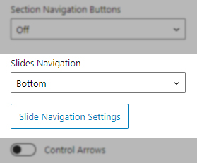

You can access the bullet options when you click on **Slide Navigation Settings** button.

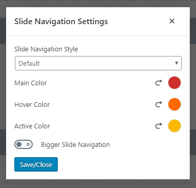

* *Slide Navigation Style*: You can select the navigation bullet style with this option.
* *Main Color*: You can choose the primary color of the bullets.
* *Hover Color*: You can choose the primary color of the bullets when mouse is on the bullets.
* *Active Color*: You can choose the primary color when the slide bullet is active.
* *Bigger Slide Navigation*: You can enable this option to see bigger navigation bullets.

### Control Arrows

This option determines whether to use control arrows for the slides to move right or left.

### Lock Anchors

This option determines whether anchors in the URL will have any effect at all in the library.

### Disable Anchors

This parameter determines whether to enable or disable all section anchors.

### Animate Anchor

This option defines whether the load of the site when given an anchor (#) will scroll with animation to its destination or will directly load on the given section.

### Keyboard Scrolling

This option defines if the content can be navigated using the keyboard.

### Record History

This option defines whether to push the state of the site to the browser's history. When enabled, each section/slide of the site will act as a new page and the back and forward buttons of the browser will scroll the sections/slides to reach the previous or next state of the site. When disabled, the URL will keep changing but will have no effect on the browser's history. This option is automatically disabled when [*Auto Scrolling*](#auto-scrolling) option is disabled.

## Scrolling

Scrolling section includes the options about scrolling mechanism.

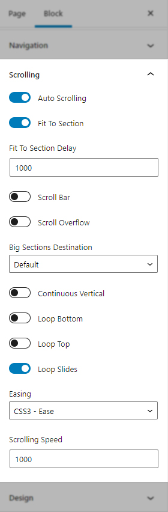

### Auto Scrolling

This option defines whether to use the "*automatic*" scrolling or the "*normal*" one. It also has affects the way the sections fit in the browser/device window in tablets and mobile phones.

### Fit To Section

This option determines whether or not to fit sections to the viewport or not. When set to true the current active section will always fill the whole viewport. Otherwise the user will be free to stop in the middle of a section.

### Scroll Bar

This option determines whether to use scrollbar for the site or not. In case of using scroll bar, the autoScrolling functionality will still work as expected. The user will also be free to scroll the site with the scroll bar and fullPage will fit the section in the screen when scrolling finishes.

### Scroll Overflow

This option defines whether or not to create a scroll for the section/slide in case its content is bigger than the height of it. When set to true, your content will be wrapped by the plugin.

* **Show Scroll Overflow Scrollbars**

  The scrollbars will be visible when enabled. Otherwise, it will be not visible, however still able to scroll inside the section.

* **Fade Scroll Overflow Scrollbars**

  Fades the scroll bars when not used.

* **Interactive Scroll Overflow Scrollbars**

  The scrollbars can be clickable and scrollable by mouse when enabled.

### Big Sections Destination

This option defines how to scroll to a section which size is bigger than the viewport. By default fullPage scrolls to the top if you come from a section above the destination one and to the bottom if you come from a section below the destination one. Possible values are top, bottom, default.

### Continuous Vertical

This option defines whether scrolling down in the last section or should scroll down to the first one and if scrolling up in the first section should scroll up to the last one.

### Loop Bottom

This option defines whether scrolling down in the last section should scroll to the first one or not.

### Loop Top

This option defines whether scrolling up in the first section should scroll to the last one or not.

### Loop Slides

This option defines whether horizontal sliders will loop after reaching the last or previous slide or not.

### Easing

This option defines the transition effect to use for the vertical and horizontal scrolling. It includes CSS3 and JS transition effects.

### Scrolling Speed

Speed in milliseconds for the scrolling transitions.

## Design

Design section includes options about the elements of fullpage.

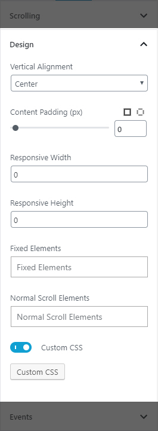

### Vertical Alignment

This option defines vertical position of the content within sections.

### Content Padding

This option defines the padding of the sections.

### Responsive Width

A normal scroll will be used under the defined width in pixels. A class fp-responsive is added to the body tag in case the user wants to use it for their own responsive CSS. For example, if set to 900, whenever the browser's width is less than 900 the plugin will scroll like a normal site.

### Responsive Height

A normal scroll will be used under the defined height in pixels. A class fp-responsive is added to the body tag in case the user wants to use it for their own responsive CSS. For example, if set to 900, whenever the browser's height is less than 900 the plugin will scroll like a normal site.

### Fixed Elements

This option defines which elements will be taken off the scrolling structure of the plugin which is necessary when using the css3 option to keep them fixed. It requires a string with the JavaScript selectors for those elements. (For example: fixedElements: '#element1, .element2')

### Normal Scroll Elements

If you want to avoid the auto scroll when scrolling over some elements, this is the option you need to use. (useful for maps, scrolling elements etc.) It requires a string with the JavaScript selectors for those elements. (For example: normalScrollElements: '#element1, .element2'). This option should not be applied to any section/slide element itself.

### Custom CSS

You can add your custom CSS.

## Events

Events section includes JavaScript events for the plugin.

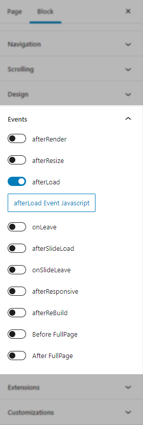

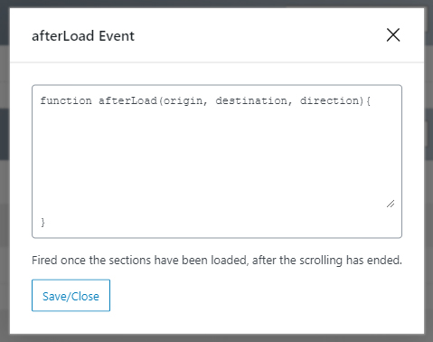

### afterRender

This callback is fired just after the structure of the page is generated. This is the callback you want to use to initialize other plugins or fire any code which requires the document to be ready (as this plugin modifies the DOM to create the resulting structure).

### afterResize

This callback is fired after resizing the browser window. Just after the sections are resized.

### afterLoad

This callback is fired once the sections have been loaded, after the scrolling has ended.

### onLeave

This callback is fired once the user leaves a section, in the transition to the new section. Returning false will cancel the move before it takes place.

### afterSlideLoad

This callback is fired once the slide of a section have been loaded, after the scrolling has ended.

### onSlideLeave

This callback is fired once the user leaves an slide to go to another, in the transition to the new slide. Returning false will cancel the move before it takes place.

### afterResponsive

This callback is fired after fullpage changes from normal to responsive mode or from responsive mode to normal mode.

### afterReBuild

This callback is fired after manually re-building fullpage.js by calling `fullpage_api.reBuild()`.

### Before FullPage

This callback is fired right before initializing fullpage.js.

### After FullPage

This callback is fired right after initializing fullpage.js.

## Extensions

Extensions section includes FullPage Extension options. The extensions can be purchased on <a href="https://alvarotrigo.com/fullPage/extensions/" target="_blank">FullPage Extensions</a> page.

***Note: These options are only available if at least one extension is purchased. The plugin is not bundled with these extensions.***

### Activating The Extension

When you purchase an extension, you will need to activate the extension for a domain. **Please note that, there is no deactivation for extensions**.

You can use the extension without activating it on a domain (a staging domain for example). When a non-activated extension is used on a domain, a red box will appear but it will be removed upon activation.

Please follow the steps below, when you want to activate the extension on the production domain.

- Go to the <a href="https://alvarotrigo.com/fullPage/extensions/activationKey.html">activation web site</a>.

- Choose your extension and enter your *License Key* you've received via email upon the purchase.

### Installing The Extension

- If you've installed the old extension plugin, please deactivate the plugin and delete it.

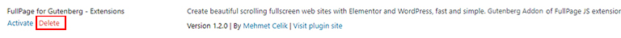

- Go to *FullPage for Gutenberg* settings page. You will see extension list.

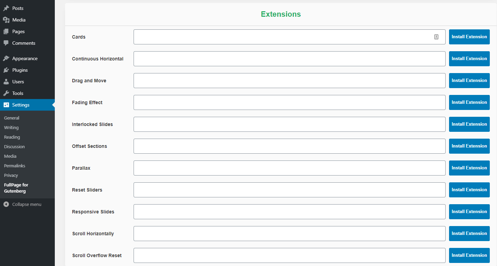

- Enter your *License Key* you've received via email upon the purchase for the corresponding extension.

- Click on *Install Extension* button for the corresponding extension.

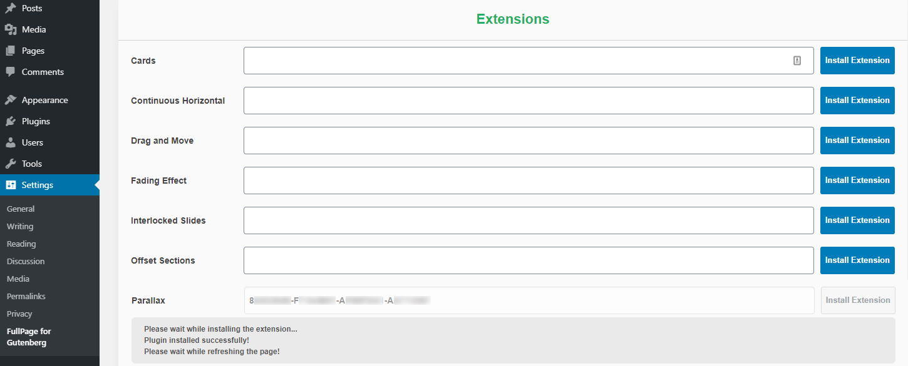

- After a successfull installation, the page will refresh and the extension plugin should be installed.

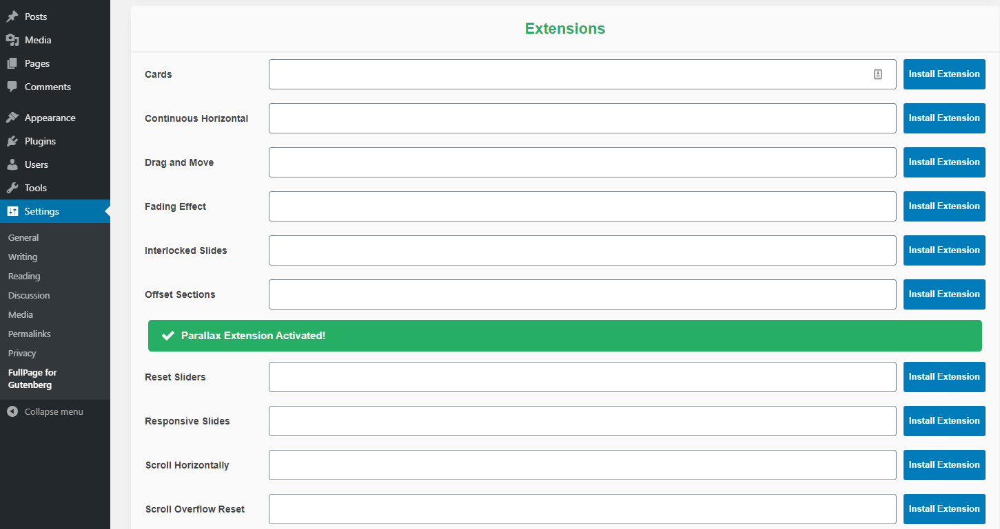

### Using The Extension

After the extension is installed,

- Enable `Enable FullPage Extensions` option under Extensions tab of FullPage options.

- You should see the extension. Enable the corresponding extension and adjust its option(s) as suitable.

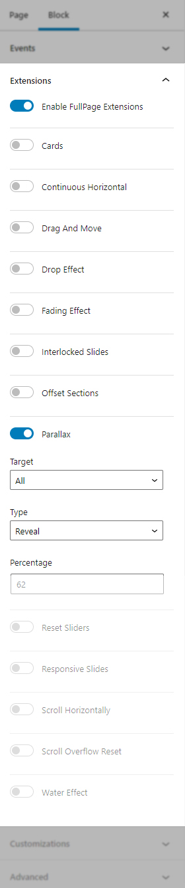

### Removing the Extension

To remove the extension, go to your Plugins page and Deactivate/Delete the extension plugin.

## Customizations

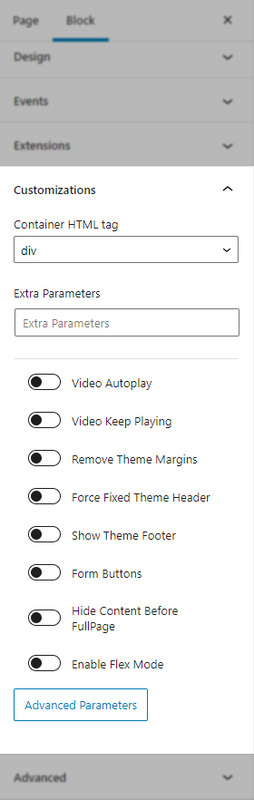

### Container HTML tag

This parameter changes the container HTML tag to the specified tag.

### Extra Parameters

If needed, any extra fullpage.js parameters can be used.

### Video Autoplay

If the page has video(s) in sections/slides, this parameter will make the videos play when the section is visible, otherwise pauses on section leave.

### Video Keep Playing

If the page has video(s) in sections/slides, this parameter will make the videos play all the time, even if the section/slide is not in the view.

### Remove Theme Margins

This option tries to remove the page wrapper margins, so the page can be full width.

### Force Fixed Theme Header

This option tries to make the header fixed at the top, and arranges the section content accordingly. **Theme Header Selector** option should be given as a JavaScript selector.

### Show Theme Footer

This option tries to move the specified site footer as an auto-height section at the end. **Theme Footer Selector** option should be given as a JavaScript selector.

### Form Buttons

This option applies a fix for the forms inside sections when Scroll Overflow option is enabled.

### Hide Content Before FullPage

When this option is enabled, an empty content will be shown before FullPage is loaded. The content is shown after FullPage is loaded and enabled.

### Enable Flex Mode

When this option is enabled, modern Flex mode is used at the output.

### Advanced Parameters

#### Enable JQuery Dependency

FullPage does not depend on jQuery. But if you want to load jQuery on the page, enable this option.

#### Enable Empty Page Template

<iframe width="560" height="315" src="https://www.youtube.com/embed/QsiSkkrRQzo" frameborder="0" allow="accelerometer; autoplay; encrypted-media; gyroscope; picture-in-picture" allowfullscreen></iframe>
 

This option enables Empty Page Template option. By default FullPage for Gutenberg comes with an empty page template, and this option is enabled. When FullPage is enabled, an empty page with no theme dependency is loaded.

You can disable this option and load theme template. When this option is disabled, theme header and footer is loaded as well. You might need to know CSS and JavaScript to change the behaviour of the page.

#### Use Template Redirect

This parameter defines if template will be redirected or included. If set, template will be redirected, otherwise template will be included. Play with this setting to see the best scenario that fits. This option is enabled only when Empty Page Template is used.

#### Template Path

You can provide your own template, such as a modified version of the theme template. If you want to use your own template, put the template path here. If left empty, the empty predefined page template will be used.

#### Remove Theme JS

This parameter removes theme JavaScript files from output. Be aware, this might crash the page output if the theme has JS output on the head section.

Enable this option if you want to remove theme JavaScript files, on necessary cases such as conflicts between theme and FullPage. Enabling this option is not recommended on production environments, and is used for debugging purposes.

#### Remove JS

This parameter removes specified JavaScript file from output. Be aware, this might crash the page output. Write JavaScript names with comma in between.

## FAQ

#### Can I move my license to another server?

Yes, you can! You can *deactivate* your license on your old server and use the same license on your new server. Don't forget to *Deactivate*. Please see [License Key](#license-key "License Key") section for more information.

#### How can I generate the invoice for the plugin?

You would have received an email from Gumroad that shows the plugin license key as well as an *Invoice* button. You can generate your invoice by clicking on that button.

#### I cannot see extensions even if I installed the Extensions plugin!

FullPage extensions can be purchased separately and is not available with the plugin out-of-the-box. If you haven't purchased any extension, you don't need to use/activate the extensions plugin.

If you have purchased one or more extensions, please take a look at the [Extensions](#extensions "Extensions") section for the tutorial video that shows how to install them.

#### How can I show a normal web site on mobile and fullpage scrolling web site on desktop?

You can activate Responsive Mode. To activate Responsive Mode, please set [Responsive Width](#responsive-width "Responsive Width") option to `767` (or any screen width you want). That's it! For the screens that has width less than `767px`, a normal scrolling web site will be shown.

You can also try setting [Responsive Auto-Height](#section-behaviour "Section Behaviour") option for the sections.

#### I cannot see my header and footer!

By default, empty page template is enabled. To disable it, please take a look at the [tutorial video](#enable-empty-page-template "Enable Empty Page Template").

#### I cannot scroll to my footer!

If scrollbars are disabled, only the content inside the sections are visible. To be able to show the footer, it needs to be moved inside a section. You can use the [Show Theme Footer](#show-theme-footer "Show Theme Footer") customization.

#### Sections are getting cut off! I cannot see the rest of my content!

When the scrollbars are disabled and your content is greater than the screen height, some of your content might be left outside of the viewport. To display these, you can enable [Scroll Overflow](#scroll-overflow "Scroll Overflow") option. This will create an in-section scrollbar.

#### The Block Generates Error / FullPage Block Contains Unexpected or Invalid Content

Sometimes with the update of Gutenberg, WordPress or other third party plugins, FullPage block might generate an error. If you see `This block contains unexpected or invalid content.` instead of the FullPage block, please first take a database backup, just in case, and use `Attempt Block Recovery` button. Do NOT use `Convert to Classic Block` option.

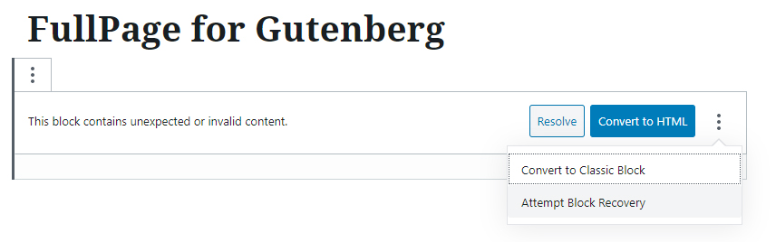

#### How do I remove anchors from URL?

If you want to remove the anchors (your-domaion.com/`#anchor`), you can enable [Lock Anchors](#lock-anchors "Lock Anchors") or [Disable Anchors](#disable-anchors "Disable Anchors") option. Enabling one of these two options will remove the anchor part from the URL.

#### Why my scroll based animations or events don't work?

Some of the WordPress plugins or Javascript libraries that depend on scrolling mechanism such as sticky menus, animations etc. might not work if scroll bar is disabled using the plugin. Please enable the [Scroll Bar](#scroll-bar "Scroll Bar") option to enable scroll based animations.